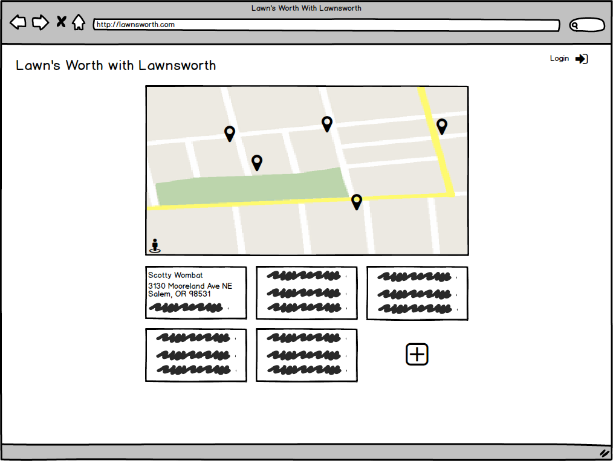

# Lawn Tracker

Web app to manage a list of clients who need their lawn services, in terms of their address/location, lot size, turf type, and other relevant information.

## User Story
Johnny Lawnsworth is a 36 years old, small business owner, living in Brazos Valley region of Texas, who runs a lawn care services for his clients. He employs a small team of diligent workers and owns professional lawn care equipments. His business is growing steadily and he needs a management tool to keep track of his client's addresses, lot size and lawn type to efficiently schedule his team for timely services depending on the customer's needs, turf characteristics and weather forecast.

## Instruction
Go to this link to see the app deployed: ([link](#))

To run it locally,
1. Clone this repository
1. `npm install`
1. `npm start`
1. Direct the browser to `localhost:3000/`

## Technology Stacks
- [node](http://nodejs.org)/npm - A server side JavaScript tool and the accompanying package manager
- [express.js](https://github.com/expressjs/express) - A back-end web framework for [node](http://nodejs.org)
- jQuery - A JavaScript library that allows for cleaner, less verbose code
- ejs - Embedded JavaScript allows JS to be incorporated in HTML codes
- OAuth - Enables authorization of user login by 3rd party sources
- MongoDB/Mongoose - NoSQL database used to create and store data
- Google Maps API - for visualizing the location information

## Wireframe

## Trello
Go to this link to see the board: ([link](https://trello.com/b/4VvhIUuh/lawn-tracker-app-by-lawnsworth): private access)

## Routes
|URL|HTTP Verb|Action|Description|
|---|---|---|---|
|/clients           |GET|index|Show all clients|
|/clients/new       |GET|new|Show new client form|
|/clients           |POST|create|Create a client|
|/clients/:id       |GET|show|Show client with :id|
|/clients/:id/edit|GET|edit|Show edit form for client with :id|
|/clients/:id|PATCH|update|Update client with :id|
|/clients/:id/delete|GET|delete|Show delete form for client with :id|
|/clients/:id|DELETE|destroy|Delete client with :id|

## Database ERD

## References
1. favicon made by [Freepik](http://www.freepik.com) from [Flaticon](https://www.flaticon.com/) is licensed by [Creative Commons BY 3.0](http://creativecommons.org/licenses/by/3.0/)
1. Geocoding - Google Maps API Developer's Guide ([link](https://developers.google.com/maps/documentation/geocoding/intro))
